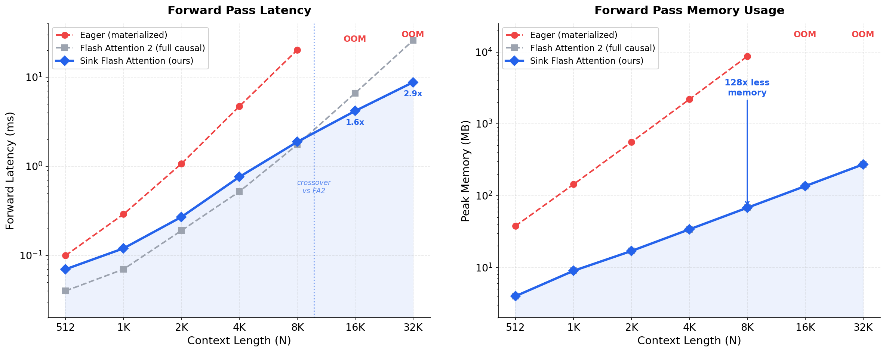
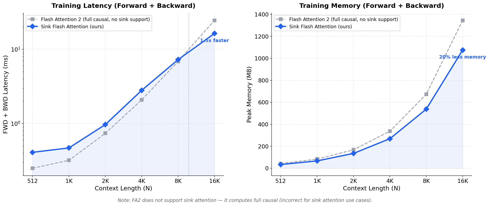

# Sink Flash Attention

A Triton kernel implementing [Flash Attention](https://arxiv.org/abs/2307.08691) with [Attention Sink](https://arxiv.org/abs/2309.17453) support for training on A100/H200 GPUs.

Flash Attention 2 doesn't support sink attention. Flash Attention 3 does, but only runs on B200. This kernel fills the gap with a pure Triton implementation that works on any GPU Triton supports.

## TL;DR

```bash
pip install sink-flash-attention
```

**As a standalone kernel:**

```python
from sink_attention import sink_flash_attention

# Drop-in replacement for attention -- supports forward + backward
output = sink_flash_attention(
    q, k, v,          # [B, H, N, D] -- supports GQA (H_q != H_kv)
    num_sink=4,        # always attend to first 4 tokens
    window_size=4096,  # sliding window for the rest
)
```

**Monkey-patch verl / any HuggingFace model (one line):**

```python
from sink_attention import patch_verl_with_sink_attention
patch_verl_with_sink_attention()

# That's it. All attention layers now use sink attention.
# Works with verl GRPO, FSDP, Ulysses sequence parallelism.
# No other code changes needed.
#
# For gpt-oss: s_aux is automatically extracted from model kwargs.
# For other models: num_sink/window_size are passed to the kernel.
```

**Inference with KV cache:**

```python
from sink_attention import patch_for_generation

cache = patch_for_generation(model, num_sink=4, window_size=4096)
output = model.generate(input_ids, past_key_values=cache, max_new_tokens=1024)
```

## Why not Flash Attention 2?

FA2 has two critical limitations:

1. **No sink attention.** FA2 only supports full causal or sliding window (without sinks). Using FA2 with `sliding_window` drops the sink tokens and degrades model quality.

2. **Silently drops `s_aux`.** Models like gpt-oss pass a learnable sink scalar (`s_aux`) through `**kwargs` in the attention interface. FA2 ignores all kwargs, so `s_aux` is silently dropped. This produces **159x higher error** compared to our kernel (measured on gpt-oss-20b, see above).

FA3 supports sink attention but requires B200 GPUs. This kernel gives you correct attention (with sinks and `s_aux`) on A100/H200.

## Installation

```bash
pip install sink-flash-attention
```

From source:

```bash
pip install git+https://github.com/RulinShao/sink-flash-attention-kernel.git
```

## gpt-oss `s_aux` (Learnable Attention Sink) Support

gpt-oss models use a learned scalar `s_aux` (stored as `self.sinks` in the model, shape `[H_q]`) per attention head instead of positional sink tokens. This scalar acts as an extra logit in the softmax that absorbs probability mass without contributing to the value-weighted output — effectively a learnable attention sink.

**FA2 silently drops `s_aux`** because it's passed through `**kwargs` which FA2 ignores. This produces significantly degraded outputs.

Our kernel natively supports `s_aux` in both forward and backward passes:

```python
from sink_attention import sink_flash_attention

output = sink_flash_attention(
    q, k, v,
    num_sink=0,           # no positional sinks (gpt-oss uses s_aux instead)
    window_size=128,      # per-layer sliding window
    s_aux=model.sinks,    # [H_q] learnable sink scalar
)
```

### gpt-oss Model-Level Validation (gpt-oss-20b, H200)

Compared forward pass logits of three configurations on identical input (seq_len=512, bf16):

| Comparison | Mean Abs Diff | Max Abs Diff | Cosine Sim | Top-1 Token Match |
|-----------|-------------:|-------------:|-----------:|------------------:|
| **Kernel vs Eager** | **0.013** | **1.16** | **1.013** | **4/5** |
| FA2 vs Eager | 1.993 | 17.33 | 0.786 | 0/5 |

**Our kernel is 159x closer to eager (ground truth) than FA2.** FA2 produces completely wrong outputs because it ignores `s_aux`.

gpt-oss-20b `s_aux` statistics (24 layers, 64 heads each):
- Full attention layers: mean s_aux ≈ 2.0–4.1 per head
- Sliding attention layers: mean s_aux ≈ 1.1–2.5 per head
- These are large values — ignoring them fundamentally changes the attention distribution.

### s_aux Unit Tests

| Test | Status | Details |
|------|--------|---------|
| Forward: full causal + s_aux (fp16 MHA) | ✅ PASS | vs eager reference |
| Forward: full causal + s_aux (bf16 GQA) | ✅ PASS | H_q=8, H_kv=2 |
| Forward: sliding window + s_aux (fp16) | ✅ PASS | window=128, N=256 |
| Forward: without s_aux (unchanged) | ✅ PASS | backward-compatible |
| Forward: s_aux mass absorption | ✅ PASS | large s_aux → smaller output norms |
| Backward: ds_aux gradient exists | ✅ PASS | finite, correct shape |
| Backward: ds_aux numerical gradient | ✅ PASS | analytical vs numerical: max diff 1.19e-3 |
| Backward: dQ, dK, dV gradients finite | ✅ PASS | all gradients exist and finite |
| Forward: gpt-oss eager comparison | ✅ PASS | full + sliding window configs |
| Forward: head_dim=80 (gpt-oss-20b) | ✅ PASS | bf16, GQA |

## What is Sink Attention?

In autoregressive LLMs, the first few tokens receive disproportionately high attention scores regardless of their semantic content ([Xiao et al., 2023](https://arxiv.org/abs/2309.17453)). These "attention sinks" are critical for model quality. Standard sliding window attention evicts them, causing quality degradation.

Sink attention fixes this by always keeping the first `k` tokens in the attention window:

```
For query at position i, attend to:
  - Tokens [0, num_sink)                           -- always (sinks)
  - Tokens [max(num_sink, i - window_size + 1), i] -- sliding window (causal)

Mask visualization (S=sink, W=window, .=masked, num_sink=2, window_size=3):

         Keys: 0 1 2 3 4 5 6 7 8 9
Query 0:       W
Query 1:       S W
Query 2:       S S W
Query 3:       S S W W
Query 4:       S S . W W
Query 5:       S S . . W W
Query 6:       S S . . W W W
Query 7:       S S . . . W W W
Query 8:       S S . . . . W W W
Query 9:       S S . . . . . W W W
```

## Design

### Two-Range Iteration

The core optimization: instead of iterating over all N/BLOCK_N KV blocks with runtime skip (O(N) loop iterations), the kernel uses two tight loops:

1. **Sink loop**: `range(NUM_SINK_BLOCKS)` -- processes `ceil(num_sink / BLOCK_N)` blocks
2. **Window loop**: `range(MAX_WINDOW_BLOCKS)` with runtime start/end -- processes `ceil((window_size + BLOCK_M) / BLOCK_N)` blocks

The gap between sink and window regions is never touched. Total work per query block: **O(num_sink + window_size)** instead of O(N).

```
KV blocks:  [SINK] [SINK] [....skip....] [WIN] [WIN] [WIN] [WIN]
                                ↑
                    Never loaded or processed
```

### Online Softmax Across Non-Contiguous Blocks

The online softmax (Milakov & Gimelshein, 2018) naturally handles the gap between sink and window regions. The running max `m_i` and sum `l_i` carry state from the sink phase into the window phase. NaN-safe guards handle edge cases where a block has no valid entries for some query rows (`-inf - (-inf)` would produce NaN without protection).

### Three Kernels

| Kernel | Grid | Description |
|--------|------|-------------|
| `_sink_flash_attn_fwd_kernel` | `(ceil(N/BLOCK_M), B*H_q)` | Forward pass. Two-range KV iteration. Stores output O and log-sum-exp LSE. |
| `_sink_flash_attn_bwd_dkdv_kernel` | `(ceil(N/BLOCK_N), B*H_q)` | Backward dK/dV. For each KV block, iterates over Q blocks that attend to it. Sink blocks iterate over all subsequent Q blocks; window blocks iterate over a bounded range. |
| `_sink_flash_attn_bwd_dq_kernel` | `(ceil(N/BLOCK_M), B*H_q)` | Backward dQ. Same two-range structure as forward. Applies `scale` factor at the end. |

### Unified Mask

All three kernels share a single mask function:

```python
valid(i, j) = causal(j <= i) AND (j < num_sink OR j >= i - window_size + 1)
```

This avoids the bug of treating sink and window as mutually exclusive regions -- a single KV block can contain both sink positions and window positions.

### Supported Configurations

- **Attention**: MHA, GQA, MQA (any H_q/H_kv ratio where H_q % H_kv == 0)
- **Dtypes**: fp16, bf16
- **Head dims**: 64, 128, 256
- **Edge cases**: num_sink=0 (pure sliding window), window_size=1 (sink + self only)

## Performance

Benchmarked on NVIDIA H200 (143GB), torch 2.10.0, triton 3.6.0.

Config: B=1, H_q=32, H_kv=8 (GQA 4:1), D=128, num_sink=4, window_size=4096.

### Forward Pass



### Training (Forward + Backward)



### Sink FA vs Eager (Materialized) Attention

Like Flash Attention, this kernel uses tiled online softmax and never materializes the N×N attention matrix. This gives O(N) memory instead of O(N^2).

| N | Sink FA | Eager Attention | Speedup | Mem Sink | Mem Eager |
|------:|--------:|--------------------:|--------:|---------:|-----------------:|
| 512 | 0.07 ms | 0.10 ms | 1.5x | 4 MB | 38 MB |
| 1,024 | 0.12 ms | 0.29 ms | 2.4x | 9 MB | 144 MB |
| 2,048 | 0.27 ms | 1.07 ms | 3.9x | 17 MB | 558 MB |
| 4,096 | 0.80 ms | 4.70 ms | 5.8x | 34 MB | **2,198 MB** |
| 8,192 | 2.09 ms | 20.20 ms | **9.5x** | 68 MB | **8,724 MB** |
| 16,384 | 4.67 ms | OOM | -- | 136 MB | OOM |
| 32,768 | 9.85 ms | OOM | -- | 273 MB | OOM |

At N=8192 the kernel uses **128x less memory** than eager attention.

### Sink FA vs Flash Attention 2 (via SDPA)

**FA2 does not support sink attention.** The comparison below is against FA2 running *full causal* attention -- a different and incorrect attention pattern for sink attention use cases. FA2 cannot be used as an alternative; it computes the wrong result. This comparison shows when our kernel (computing the correct sparse pattern) becomes faster than FA2 (computing the wrong dense pattern).

**Forward only:**

| N | Sink FA | FA2 (full causal) | vs FA2 | Note |
|------:|--------:|-----------------:|--------:|------|
| 4,096 | 0.76 ms | 0.52 ms | 0.7x | FA2 faster (CUDA vs Triton) |
| 8,192 | 1.88 ms | 1.75 ms | 0.9x | Approaching crossover |
| **16,384** | **4.18 ms** | **6.63 ms** | **1.6x** | **Sink FA wins** |
| **32,768** | **8.77 ms** | **25.83 ms** | **2.9x** | **Sink FA dominant** |

**Training (forward + backward):**

| N | Sink FA | FA2 (full causal) | vs FA2 | Mem Sink | Mem FA2 |
|------:|--------:|-----------------:|--------:|---------:|---------:|
| 4,096 | 2.81 ms | 2.09 ms | 0.7x | 269 MB | 337 MB |
| 8,192 | 7.28 ms | 6.89 ms | 0.9x | 538 MB | 673 MB |
| **16,384** | **16.39 ms** | **24.63 ms** | **1.5x** | **1,076 MB** | **1,346 MB** |

**Crossover at ~N=10-12K.** Below this, FA2's hand-optimized CUDA is faster per-FLOP despite doing O(N^2) work. Above this, the O(N * W) scaling wins.

### Scaling

| N | FLOPs reduction vs full causal | Measured speedup vs FA2 |
|------:|----------------------------:|----------------------:|
| 8,192 | 2.0x | 0.9x |
| 16,384 | 4.0x | 1.6x |
| 32,768 | 8.0x | 2.9x |
| 65,536 | 16.0x | ~5-6x (projected) |

### Numerical Accuracy

Compared against fp32 eager attention as the reference. The Triton kernel matches to within fp16/bf16 precision.

**Forward pass** (Triton fp16 vs eager fp32):

| Config | Max Abs Error | Mean Abs Error | Cosine Similarity |
|--------|-------------:|---------------:|------------------:|
| MHA fp16 N=256 D=64 | 9.77e-4 | 2.6e-5 | 1.00000 |
| MHA fp16 N=1024 D=64 | 9.77e-4 | 1.9e-5 | 1.00000 |
| MHA fp16 N=2048 D=64 | 9.77e-4 | 1.5e-5 | 1.00000 |
| GQA 4:1 fp16 D=128 N=512 | 1.95e-3 | 3.5e-5 | 1.00000 |
| MHA bf16 N=512 | 7.81e-3 | 2.0e-4 | 0.99999 |

**Backward pass** (Triton fp16 gradients vs eager fp32 gradients):

| Config | dQ Max Error | dK Max Error | dV Max Error |
|--------|------------:|------------:|------------:|
| MHA N=128 sink=4 win=32 | 1.66e-3 | 1.96e-3 | 1.94e-3 |
| GQA N=256 sink=4 win=64 | 1.17e-3 | 2.98e-3 | 4.16e-3 |
| MHA D=128 N=256 | 1.47e-3 | 1.94e-3 | 2.48e-3 |

All errors within expected fp16 precision bounds. Cosine similarity is 1.0 across all configurations.

## Inference

The inference module provides KV cache management with sink + sliding window eviction and a decode-time attention kernel. During generation, the cache retains `num_sink` initial tokens permanently and maintains a circular buffer of the most recent `window_size` tokens.

### Usage

```python
from sink_attention import patch_for_generation, unpatch_generation

# Patch model and get cache
cache = patch_for_generation(model, num_sink=4, window_size=4096)

# Generate as normal — cache is passed as past_key_values
output = model.generate(input_ids, past_key_values=cache, max_new_tokens=1024)

# Restore original attention when done
unpatch_generation()
```

### Decode Numerical Accuracy

Decode outputs compared against fp32 naive reference (NVIDIA H200, PyTorch 2.10.0, CUDA 12.8):

| Config | Max Abs Error | Mean Abs Error | Cosine Similarity |
|--------|-------------:|---------------:|------------------:|
| MHA(4) D=64 N=20 fp32 | 2.98e-7 | 4.61e-8 | 1.000000 |
| MHA(4) D=128 N=32 fp32 | 1.79e-7 | 3.53e-8 | 1.000000 |
| GQA(8/2) D=64 N=24 fp32 | 3.28e-7 | 5.15e-8 | 1.000000 |
| GQA(32/8) D=128 N=64 fp32 | 4.47e-7 | 3.87e-8 | 1.000000 |
| MHA(4) D=64 N=20 fp16 | 9.77e-4 | 1.11e-4 | 1.000000 |
| GQA(32/8) D=128 N=64 fp16 | 9.77e-4 | 8.91e-5 | 1.000000 |
| GQA(8/2) D=128 N=32 bf16 | 7.81e-3 | 1.01e-3 | 0.999992 |

Multi-step decode with eviction (worst-case error across all decode steps):

| Config | Avg Max Error | Worst Error |
|--------|-------------:|------------:|
| MHA(4) D=64 sink=2 win=4 10 steps fp32 | 2.41e-7 | 3.58e-7 |
| MHA(4) D=128 sink=4 win=8 20 steps fp32 | 2.56e-7 | 4.77e-7 |
| GQA(8/2) D=64 sink=4 win=8 15 steps fp32 | 2.68e-7 | 5.96e-7 |
| MHA(4) D=64 sink=2 win=4 10 steps fp16 | 9.52e-4 | 1.22e-3 |
| MHA(4) D=128 sink=4 win=8 20 steps fp16 | 9.31e-4 | 1.95e-3 |

### Decode Latency

Decode kernel (single-query attention against cached KV) compared to running the full training kernel with N_q=1. Config: B=1, GQA(32/8), D=128, num_sink=4.

| Window Size | N_kv | Decode | Training Kernel | Speedup |
|------------:|-----:|-------:|----------------:|--------:|
| 128 | 132 | 0.056 ms | 0.032 ms | 0.6x |
| 512 | 516 | 0.057 ms | 0.034 ms | 0.6x |
| 1,024 | 1,028 | 0.056 ms | 0.088 ms | 1.6x |
| 2,048 | 2,052 | 0.069 ms | 0.284 ms | 4.1x |
| 4,096 | 4,100 | 0.119 ms | 0.944 ms | **7.9x** |

With GQA(64/8):

| Window Size | N_kv | Decode | Training Kernel | Speedup |
|------------:|-----:|-------:|----------------:|--------:|
| 1,024 | 1,028 | 0.068 ms | 0.152 ms | 2.2x |
| 4,096 | 4,100 | 0.209 ms | 1.724 ms | **8.2x** |

### Cache + Decode Overhead

Per-step overhead including cache update (circular buffer write + linearization) and decode attention:

| Config | Cache Update | Decode Attn | Total |
|--------|------------:|------------:|------:|
| GQA(32/8) D=128 win=1024 | 0.057 ms | 0.057 ms | 0.114 ms |
| GQA(32/8) D=128 win=4096 | 0.081 ms | 0.120 ms | 0.201 ms |
| GQA(64/8) D=128 win=4096 | 0.080 ms | 0.210 ms | 0.290 ms |

## Sequence Parallelism (verl FSDP)

When using sequence parallelism, sink tokens (on rank 0) must be broadcast to all ranks:

```python
from sink_attention import SinkAttentionSPWrapper

attn = SinkAttentionSPWrapper(num_sink=4, window_size=4096, sp_group=sp_group)
output = attn(q_local, k_local, v_local)
```

Or use the lower-level functions:

```python
from sink_attention import prepare_sink_kv_for_sp, reduce_sink_kv_grads

# Forward: broadcast sink KV to all ranks
k_local, v_local = prepare_sink_kv_for_sp(k_local, v_local, num_sink, sp_group)
output = sink_flash_attention(q_local, k_local, v_local, num_sink, window_size)

# Backward: reduce sink KV gradients
dk_local, dv_local = reduce_sink_kv_grads(dk_local, dv_local, num_sink, sp_group)
```

See `docs/design.md` for details on ring attention integration.

## Running Tests

```bash
pip install -e .

# Basic correctness (requires GPU)
python tests/test_sink_attention.py

# s_aux (learnable attention sink) correctness -- forward, backward, gradients
python tests/test_s_aux.py

# gpt-oss model-level comparison: eager vs kernel vs FA2
python tests/test_gpt_oss_model.py --seq-len 512 --num-tokens 5

# Cache correctness
python tests/test_cache.py

# Inference decode correctness
python tests/test_inference.py

# Full inference benchmarks (numerical accuracy + latency)
python tests/run_inference_benchmarks.py

# Extended tests + benchmarks
python tests/benchmark.py
```

## Project Structure

```
sink_attention/
├── __init__.py               Public API
├── sink_flash_attention.py   Triton kernels + PyTorch autograd wrapper (with s_aux support)
├── cache.py                  KV cache (sink buffer + circular window buffer)
├── decode_kernel.py          Decode-time attention (single-query)
├── generate_patch.py         HuggingFace generate() integration
├── subprocess_eval.py        Subprocess-safe model.generate() (post-torchrun)
├── sp_utils.py               Sequence parallelism utilities
└── verl_patch.py             verl/HuggingFace monkey patch (training, s_aux-aware)
tests/
├── test_sink_attention.py    Kernel correctness tests (11 configs)
├── test_s_aux.py             s_aux correctness: forward, backward, gradients (10 tests)
├── test_gpt_oss_model.py     End-to-end model test: eager vs kernel vs FA2
├── test_cache.py             Cache correctness tests (13 tests)
├── test_inference.py         Inference decode tests (6 tests)
├── run_inference_benchmarks.py  Numerical accuracy + latency benchmarks
├── benchmark.py              Extended tests (29 configs) + benchmarks
├── numerical_accuracy.py     Numerical accuracy measurement
└── tune_block_sizes.py       Block size tuning sweep
docs/
├── design.md                 Algorithm design, SP integration, kernel details
└── architecture.md           Prefill/decode split rationale, FA3 comparison
pyproject.toml                Package configuration
```

## Architecture: Prefill/Decode Split and FA3 Comparison

We use **separate prefill and decode kernels** by design. See [`docs/architecture.md`](docs/architecture.md) for a detailed discussion of:

- **Why not a unified kernel on H200?** — The parallelism problem: with N_q=1, a prefill-style kernel only launches 64 programs (one per head at B=1) on 132 SMs. FlashDecoding parallelizes over KV splits instead, launching 32K+ programs.
- **Why FA3 can unify on B200** — TMA (async memory engine), warp specialization, and 1.67× higher HBM bandwidth let FA3 hide the serial KV walk.
- **Backward efficiency vs FA3** — Our Triton backward is ~0.5–0.7× FA2's CUDA throughput on H200, with <1% overhead from `ds_aux`. FA3 on B200 is ~2–3× faster (mostly hardware gap, not algorithmic).
- **Alignment with FA3 semantics** — Mathematically identical `s_aux` handling (softmax init: m=s_aux, l=1, o=0). Verified against gpt-oss eager reference.

## Known Issues

### CUDA context corruption after `torchrun`

**Symptom**: `CUDA error: device-side assert triggered` (ScatterGatherKernel.cu, index out of bounds) when calling `model.generate()` after `torchrun` distributed training in the same process.

**Cause**: This is a PyTorch/CUDA issue, not specific to this kernel. When `torchrun` spawns child processes that initialize NCCL and CUDA contexts, the parent process's CUDA runtime may be left in an inconsistent state. Any subsequent CUDA operation in the parent (including `model.generate()`) can trigger device-side asserts.

**Who is affected**: Users who run `torchrun` training and then `model.generate()` (HuggingFace transformers) in the same script. This is more common for sink kernel users because vLLM (which naturally runs in a separate server process) does not support custom attention kernels, so users must use transformers for inference.

**Note**: verl itself does not have this issue — it delegates generation to separate actor workers (for RL) or external vLLM servers, so it never runs `model.generate()` in the same process as `torchrun`.

**Solution**: Run inference in a separate subprocess. We provide a utility for this:

```python
from sink_attention import subprocess_generate

# After torchrun training completes in the same process:
results = subprocess_generate(
    model_path="/path/to/checkpoint",
    input_texts=["Hello, world!", "What is 2+2?"],
    max_new_tokens=256,
    sink_attention=True,   # applies patch_verl_with_sink_attention() in subprocess
    torch_dtype="bfloat16",
)
# results: list of generated strings
```

Or build your own subprocess wrapper — the key requirement is that `model.generate()` must run in a process that has never been a parent of `torchrun` child processes. See `sink_attention/subprocess_eval.py` for the full implementation.

## Limitations and Future Work

- **Triton vs CUDA gap**: Our kernel is ~50-70% of FA2's per-FLOP throughput. A CUDA implementation would close this, moving the crossover from ~N=10-12K down to ~N=6-8K.
- **Block size tuning**: Tuned for H200 (BLOCK_M=64, BLOCK_N=32 for D=128). A100 may benefit from different settings.
- **Paged KV cache**: Not yet supported. Needed for inference with dynamic batching.
- **Per-batch sequence lengths**: Cache state (write_pos, window_len) is shared across the batch. All sequences must have equal length.

## References

- [Efficient Streaming Language Models with Attention Sinks](https://arxiv.org/abs/2309.17453) (Xiao et al., 2023)
- [FlashAttention-2: Faster Attention with Better Parallelism and Work Partitioning](https://arxiv.org/abs/2307.08691) (Dao, 2023)
- [Online normalizer calculation for softmax](https://arxiv.org/abs/1805.02867) (Milakov & Gimelshein, 2018)
